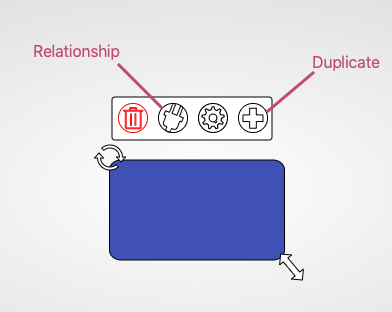
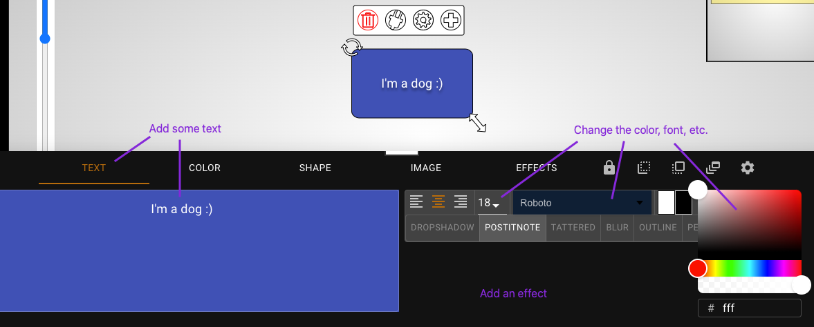
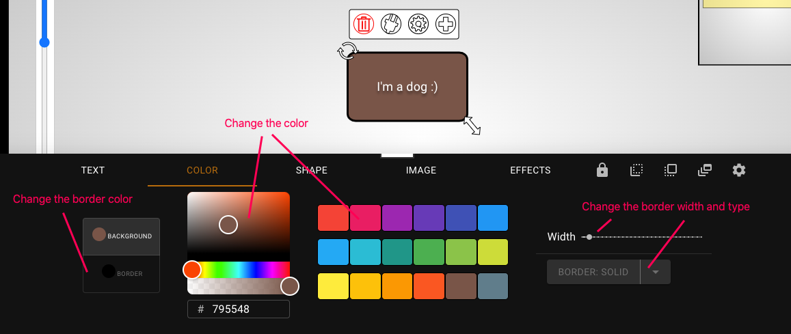
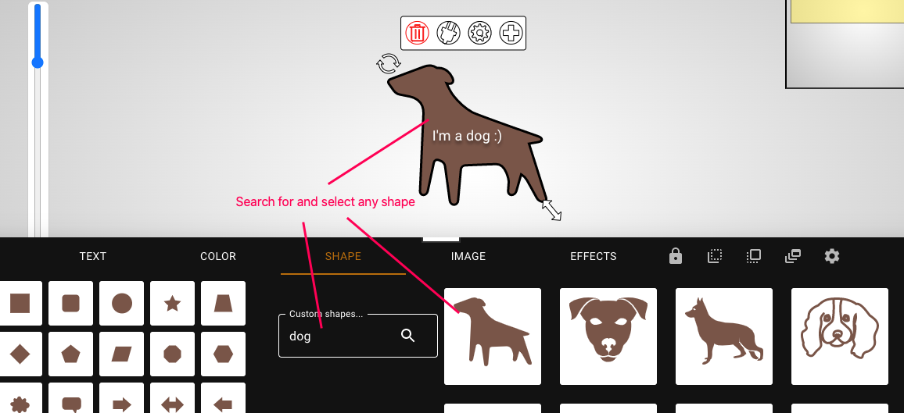

---
# Everything you need to know

https://i.imgur.com/TQlBN1u.png

**The Properties of a Node**

If you click on a node, you'll see four icons appear at the top of it.

The third icon is the properties of the node – click on it and you'll be given a menu.

Here, you can:
- type text into the node
- change its color
- change its shape
- imbed an image into the node
- add an effect

---
**The Properties of a Relationship** 

The gear icon above allows you to access the properties of a relationship. 

The "settings" tab allows you to change the color, width, and direction of the arrow (including both ways or no arrow), and the "effects" tab allows you to choose from a list of effects.