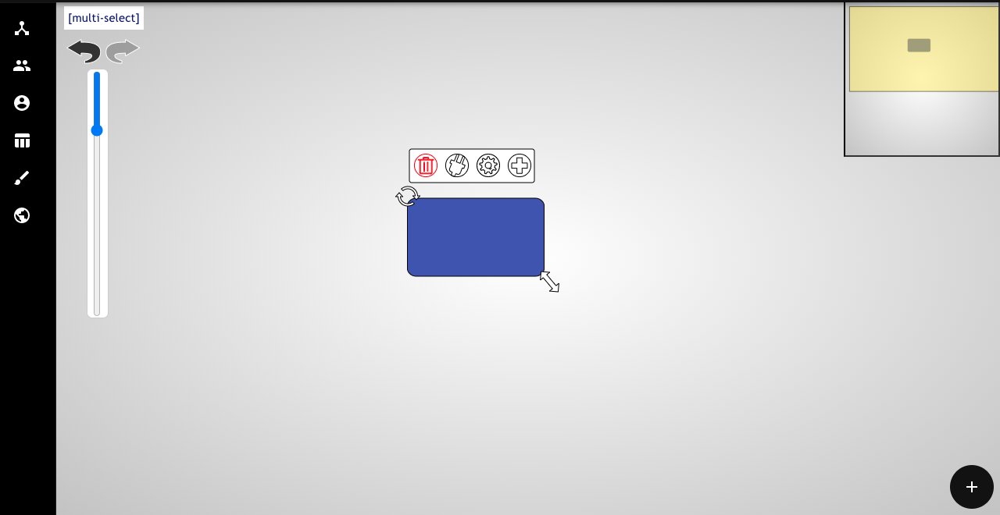

---
# Everything you need to know

**The Most Basic of Basics**

Don't have any idea what you're doing? Start here!

First off, you don't need an account to start making slates – if you prefer, just click the "Start Now. No Registration Required" option underneath the sign in tab. You'll end up on the "My Slates" site. In order to create a new slate, click the "New Slate" button on the right (see the image below).

Once you create a new slate, you'll see a couple of things on the left – multi-select, undo/redo, and a slider which allows you to zoom in and out. In the upper right-hand corner you'll see a smaller version of your slate that you can use to shift the frame (or you can just use two fingers).

---
**The Properties of a Node**

If you click on a node, you'll see four icons appear at the top of it.

The first deletes the node, the second creates a connector that you can drag to other nodes, and the fourth creates another node identical to the one you've selected. 

The third icon is the properties of the node – click on it and you'll be given a menu.

Here, you can choose to type text into the node, change its color or its shape, imbed an image into the node, or add an effect.

For example, here you can see how the shape of the node was changed to be a tree:

---
**The Properties of a Relationship** 

Say you clicked the fourth icon detailed above and created a new node. This new node, the "child" node, is now connected to the original, or "parent" node via a relationship (that is, if you're in mindmap mode, see More Advanced for more information).

If you select this relationship, you'll see there is a set of three icons. The first, once again, deletes the node and the third disconnects the relationship and allows you to drag and drop it onto a different node. 

The second icon, the gear, allows you to access the properties of the relationship. If you click on it, you're given a menu consisting of two tabs, see the image below.

The "settings" tab allows you to change the color, width, and direction of the arrow (including both ways or no arrow), and the "effects" tab allows you to choose from a list of effects.